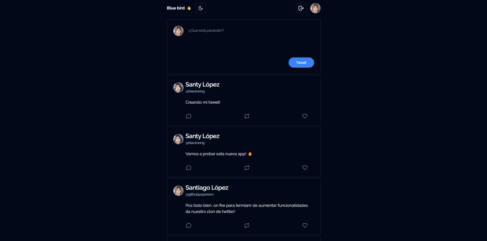
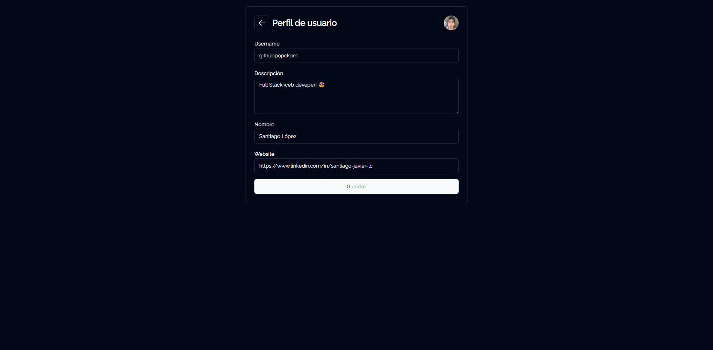
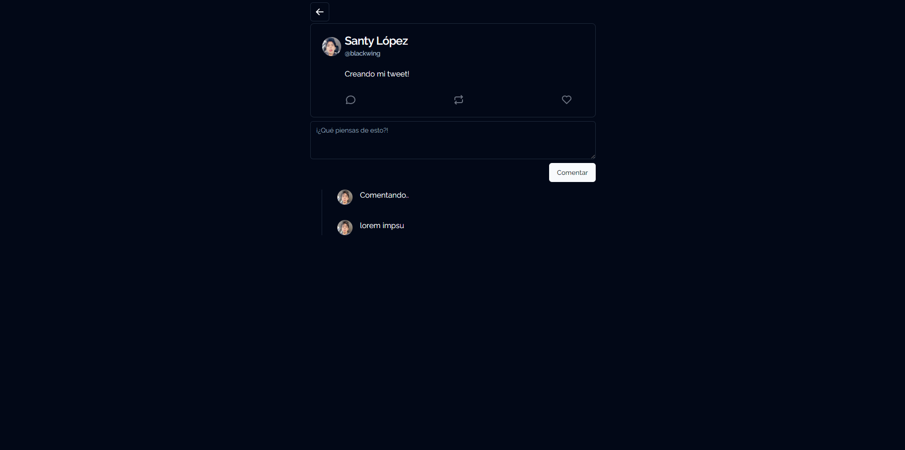
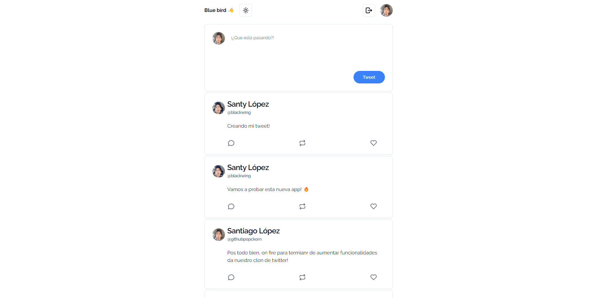
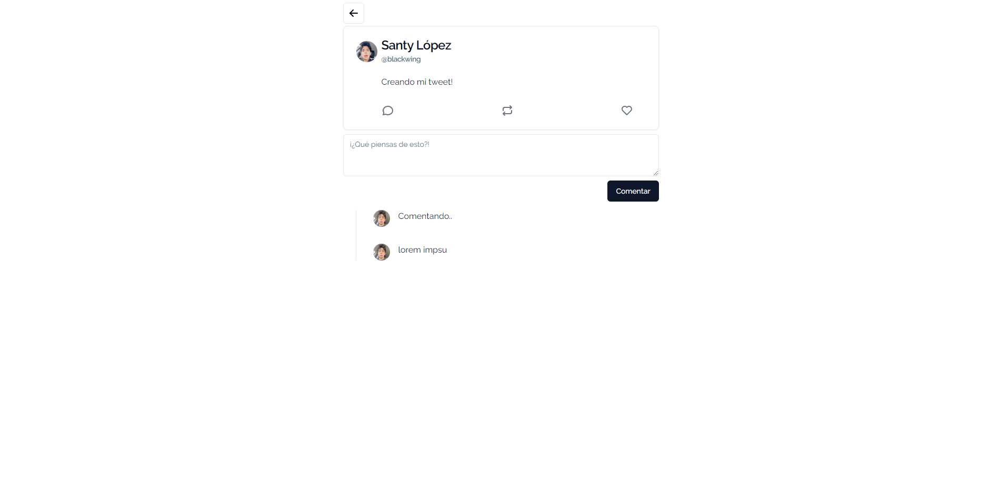

# Clone de Twitter 🤩

Aplicación desarrollada con NextJs para clonar el funcionamiento de la red social Twitter.


## Herramientas de desarrollo

 - Next Js
 - Supabase
 - Shadcn Ui & Tailwind CSS
 - Typescript


## ¿Cómo levantar el proyecto?

Realizar el git clone del proyecto, después ejecuta los siguientes comandos:

```bash
  cd ./project-folder
```

```bash
  npm install
  
  yarn

  pnpm install
```
Configurar las variables de ambiente para **Supabase** en el archivo `.env.local`
 ```bash
  NEXT_PUBLIC_SUPABASE_URL=
  NEXT_PUBLIC_SUPABASE_ANON_KEY=
```


## Authors

- [@githubpopckorn](https://github.com/githubpopckorn)


## Feedback

Si tienes algun feedback o recomendación puedes encontrarme en santy_lopez@live.com.ar


## 🚀 About Me
Full stack developer...


## License

[MIT](https://choosealicense.com/licenses/mit/)


## 🔗 Links
[](https://www.linkedin.com/in/santiago-javier-lc/)


## Screenshots

<div style="text-align:center">

<h3>Dark Mode 😎</h3>


<p></p>

<p></p>


<h3>Light Mode 🤩</h3>


<p></p>

<p></p>



